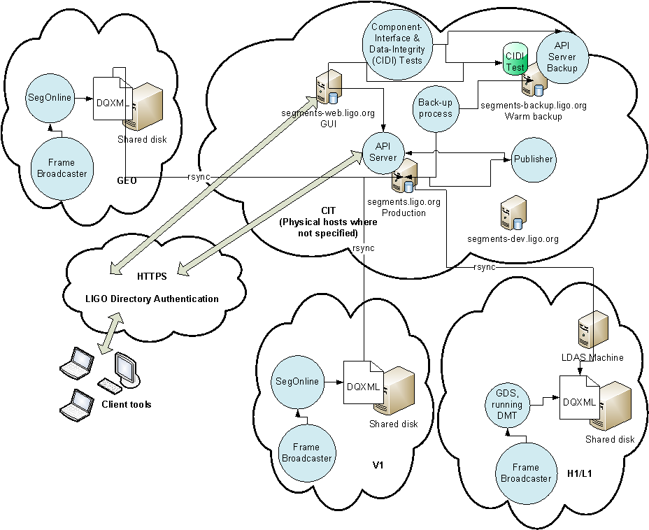

dqsegdb
=======

[](https://travis-ci.org/ligovirgo/dqsegdb)
[](https://coveralls.io/github/ligovirgo/dqsegdb?branch=master)


DQSEGDB client library and functions

Please see documentation at (last updated Aug 9 2016): 

https://ldas-jobs.ligo.caltech.edu/~rfisher/dqsegdb_doc/

The DQSEGDB package should be installed and available for use on all LIGO Tier 1 and 2 clusters.  

Within this project, the bdist directory includes complete (including dependencies) distributible python executables, built with PyInstaller.

To use the new client tools as a user, run the following commands:

```
# Clone the repository:
git clone https://github.com/ligovirgo/dqsegdb.git

# cd into the repo
cd dqsegdb

# "Build" the package, placing binaries and libraries into standard directories
python setup.py install --user

# Setup your environment to look at the new directories
# Follow instructions provided at end of previous command
# Example:
#  source /home/rfisher/.local/etc/dqsegdb-user-env.sh
# This must be run each time you log in, or put it in your log in scripts (.bashrc)

```
dqsegdb architecture as used by IGWN
=======
<div align="center">
  
</div>

